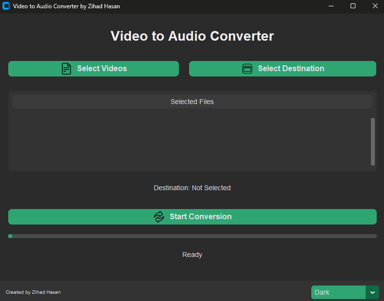

# Video to Audio Converter

Created by **Zihad Hasan**



---

A professional, modern, and easy-to-use desktop application for converting video files to high-quality **MP3 audio**.

## Features

-   **Modern & Intuitive UI:** A clean and beautiful user interface built with the `CustomTkinter` library.
-   **Multi-File Conversion:** Convert multiple video files at once with a single click.
-   **Theme Switching:** Instantly switch between **Light**, **Dark**, and **System** themes.
-   **Responsive Design:** The application is fully responsive and adapts to different screen sizes.
-   **Standalone Executable:** The application is bundled into a single executable file for easy distribution and use on any Windows machine.

## Installation & Usage

### For End-Users

1.  **Download the latest release:**
    -   Go to the [Releases](https://github.com/Z-root-X/Video-to-Audio-Converter/releases) page of this repository.
    -   Download the `Video_to_Audio_Converter.exe` file from the latest release.
2.  **Run the application:**
    -   Double-click the downloaded `.exe` file to run the application. No installation is required.

### For Developers

If you want to run the application from the source code, follow these steps:

1.  **Clone the repository:**
    ```bash
    git clone https://github.com/Z-root-X/Video-to-Audio-Converter.git
    cd Video-to-Audio-Converter
    ```
2.  **Create a virtual environment:**
    ```bash
    python -m venv venv
    venv\Scripts\activate
    ```
3.  **Install the dependencies:**
    ```bash
    pip install -r requirements.txt
    ```
4.  **Run the application:**
    ```bash
    python src/main.py
    ```

## Contributing

Contributions are welcome! If you have any ideas, suggestions, or bug reports, please open an issue or create a pull request.

1.  **Fork the repository.**
2.  **Create a new branch:** `git checkout -b feature/your-feature-name`
3.  **Make your changes and commit them:** `git commit -m "feat: Add new feature"`
4.  **Push to the branch:** `git push origin feature/your-feature-name`
5.  **Create a pull request.**

## License

This project is licensed under the MIT License - see the [LICENSE](LICENSE) file for details.